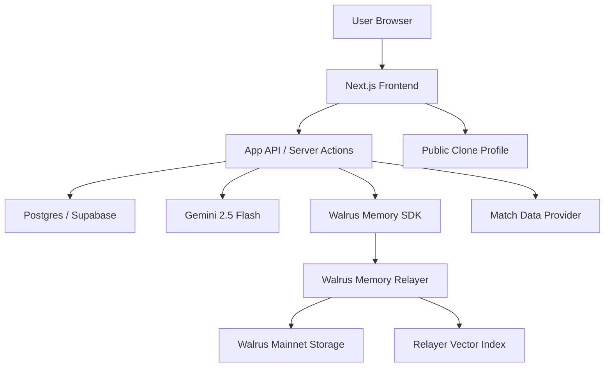

# HoolClone DApp Architecture

## 1. Executive Summary

HoolClone is a World Cup 2026 dApp where every user trains an AI football clone that gradually learns their prediction style, biases, emotional patterns, team loyalties, and recurring contradictions. The clone starts with little context, asks training questions, observes match predictions, stores durable memories on Walrus Memory, and later makes predictions as the user would.

The core product promise is:

> Train your World Cup clone, then watch it predict, argue, and expose your football biases using memories stored on Walrus.

HoolClone is designed for the Walrus Memory World Cup challenge. The submission must demonstrate genuine persistent memory, visible memory-in-action, and Walrus Mainnet deployment. The app should therefore make memory a first-class part of the UX, not a hidden implementation detail.

## 2. Product Goals

### 2.1 Primary Goals

- Create a memorable World Cup experience centered on a user's AI fan clone.
- Store agent memory and state on Walrus Memory on Mainnet.
- Show visible evidence that the clone changes behavior over multiple sessions.
- Provide a public interface where judges can inspect the memory effect.
- Keep the MVP focused enough to build, deploy, and demo reliably.

### 2.2 Non-Goals For MVP

- Real-money betting or odds.
- Complex fantasy league mechanics.
- Fully decentralized frontend hosting as a requirement, unless time allows.
- Onchain prediction settlement for every match.
- A custom LLM model trained per user.
- Full privacy-preserving client-side memory encryption in the first version.

## 3. Core User Experience

### 3.1 Main User Journey

1. User lands on HoolClone.
2. User connects wallet or creates a session identity.
3. User completes a short fan interview.
4. App stores structured memories about the user on Walrus Memory.
5. User predicts World Cup matches.
6. Clone recalls prior memories and predicts as the user.
7. User can debate, correct, or rate the clone.
8. After real or simulated match results, the app updates accuracy and bias memories.
9. Public clone profile shows memory receipts, clone evolution, and prediction record.

### 3.2 Day-One Experience

On first use, the clone should be honest about weak memory:

> "I do not know your football instincts yet. I need a few takes before I can clone you properly."

The clone asks targeted questions:

- Which team do you irrationally believe in?
- Which team do you never trust?
- Do you predict with stats, loyalty, vibes, or chaos?
- What is your worst World Cup heartbreak?
- Which player do you think is overrated?

### 3.3 Returning-User Experience

After several sessions, the clone should reference specific learned patterns:

> "You say you trust defensive teams, but your last four predictions favored star attackers in emotional knockout matches. I am cloning your actual behavior, not your self-image."

This before-and-after contrast is the most important judging signal.

## 4. System Overview

HoolClone uses a hybrid architecture:

- Traditional app backend for auth, API orchestration, match data, prediction records, public pages, and rate limiting.
- Walrus Memory for durable agent memory and recall.
- Gemini 2.5 Flash for clone generation, debate, summarization, and memory extraction.
- Database for operational app data that must be queried quickly and reliably.

### 4.1 High-Level Architecture



### 4.2 Why Hybrid Storage

Walrus Memory is the durable memory layer for the agent. It should store semantic facts, prediction patterns, emotional memories, and clone evolution summaries.

The app database still matters. It stores operational records that power the UI:

- User profile.
- Wallet/session mapping.
- Match fixtures.
- Prediction rows.
- Public profile slugs.
- API request logs.
- Clone output history.

This separation keeps the app fast and predictable while letting Walrus Memory do the agent-memory work required by the challenge.

## 5. Technology Stack

### 5.1 Recommended MVP Stack

- **Frontend:** Next.js, TypeScript, Tailwind CSS, shadcn/ui.
- **Backend:** Next.js API routes or server actions.
- **Database:** Supabase Postgres or standard Postgres.
- **Agent Memory:** `@mysten-incubation/memwal`.
- **Blockchain Storage:** Walrus Memory on Walrus Mainnet.
- **Wallet:** Sui wallet adapter, with optional guest mode during local demo.
- **LLM:** Google Gemini 2.5 Flash via `@google/generative-ai`.
- **Charts:** Recharts or Tremor.
- **Deployment:** Vercel for app, managed Postgres, Walrus Memory production relayer.

### 5.2 LLM Strategy

Use **Gemini 2.5 Flash** as the primary model for all user-facing clone work:

- Clone predictions.
- Debate and chat.
- Memory extraction.
- Post-match summaries.

Why Gemini 2.5 Flash for the hackathon:

- Free tier via Google AI Studio with no credit card.
- Native JSON schema enforcement via `responseSchema` reduces receipt hallucination.
- Strong instruction following for memory-grounded responses.
- Enough free quota (~1,500 requests/day) for demo and judging traffic.

Optional fallback if rate limits are hit during a live demo:

- **Groq `llama-3.3-70b-versatile`** for clone predictions and debate only.
- Keep Gemini as the default; use Groq only on 429 errors.

Local development fallback:

- **Ollama `qwen2.5:7b`** behind the same `LlmAdapter` interface for unlimited offline iteration.

### 5.3 Optional Advanced Stack

- Self-hosted Walrus Memory relayer for stronger trust boundaries.
- Walrus Sites for decentralized static frontend hosting.
- Edge worker for match data caching.
- Redis for rate limits and job queues.
- Background worker for match result ingestion and post-match memory updates.

## 6. Major DApp Modules

### 6.1 Identity Module

Responsibilities:

- Connect user wallet.
- Create internal user ID.
- Create or retrieve user's HoolClone profile.
- Associate Walrus Memory namespace with user.
- Support public profile slug.

Identity options:

- **Wallet-first:** Best for hackathon legitimacy.
- **Guest-first:** Best for low-friction demos.
- **Hybrid:** Let users try as guest, then connect wallet before saving to Walrus Mainnet.

Recommended MVP:

- Use wallet-first for official submission path.
- Keep a local demo fallback for judges if wallet setup fails.

### 6.2 Onboarding Interview Module

Responsibilities:

- Ask high-signal football personality questions.
- Convert answers into structured memory facts.
- Store summarized memories through Walrus Memory.
- Initialize the clone's baseline personality.

Outputs:

- `fan_profile` memory.
- `emotional_memory` entries.
- `prediction_style_seed` entry.
- Initial database profile row.

### 6.3 Match Prediction Module

Responsibilities:

- Display upcoming World Cup matches.
- Let user submit predictions.
- Capture confidence and reasoning.
- Ask clone to predict as the user.
- Store both human and clone predictions.

Prediction fields:

- Match ID.
- Team A and Team B.
- User predicted winner.
- User predicted score.
- Confidence from 1 to 100.
- Reasoning text.
- Optional first scorer.
- Optional emotional state.

### 6.4 Clone Engine Module

Responsibilities:

- Recall relevant user memories.
- Generate clone prediction.
- Explain which memories influenced prediction.
- Detect contradictions.
- Update clone state over time.

Clone modes:

- **Learner:** asks questions and stores answers.
- **Imitator:** predicts as the user.
- **Contradiction Finder:** compares self-image vs behavior.
- **Commentator:** writes recaps in the user's style.

### 6.5 Debate Module

Responsibilities:

- Let user argue with the clone.
- Let clone cite memory receipts.
- Store corrections and disagreements.
- Improve future clone behavior.

Example:

User:

> I would never pick England.

Clone:

> You picked England twice last week when France annoyed you. I have receipts.

### 6.6 Public Profile Module

Responsibilities:

- Show memory effect in a judge-friendly way.
- Display clone evolution over time.
- Display prediction record.
- Display selected memory receipts.
- Hide private or sensitive memories.

Public sections:

- Clone summary.
- Prediction accuracy.
- Bias radar.
- Funniest contradiction.
- Memory receipts.
- Human vs clone prediction comparison.
- Before/after behavior panel.

### 6.7 Admin And Demo Module

Responsibilities:

- Seed sample matches.
- Seed demo user sessions.
- Show Walrus Memory health.
- Show Mainnet configuration status.
- Export demo data for video recording.

This module is valuable for the hackathon because the demo must be reliable even if live match data is unavailable.

## 7. Memory Architecture

### 7.1 Memory Principles

HoolClone should store memories that are specific, reusable, and behavior-shaping.

Weak memory:

> User likes Argentina.

Strong memory:

> User predicted Argentina to win despite worrying about midfield fatigue, because they trust emotional superstar moments in knockout matches.

Strong memories let the clone produce responses that could not exist on day one.

### 7.2 Memory Namespacing

Use a deterministic namespace per user:

```text
hoolclone:user:<userId>
```

For shared app-level memories:

```text
hoolclone:global
```

For public demo accounts:

```text
hoolclone:demo:<demoId>
```

Do not mix users in one namespace. The clone's identity depends on clean memory boundaries.

### 7.3 Memory Types

#### fan_profile

Stores stable identity-like preferences:

- Favorite team.
- Rival team.
- Favorite players.
- Disliked teams.
- Preferred tactical style.
- Prediction tone preference.

#### prediction_pattern

Stores inferred behavioral tendencies:

- Overvalues star players.
- Picks emotional favorites.
- Underrates defensive teams.
- Often predicts narrow scorelines.
- Confidence too high in group-stage matches.

#### emotional_memory

Stores meaningful fan reactions:

- Heartbreak moments.
- Rivalry grudges.
- Superstitions.
- Teams that trigger panic.
- Moments of irrational optimism.

#### prediction_history_summary

Stores summarized prediction behavior:

- Match prediction.
- Reasoning.
- Actual outcome.
- Accuracy.
- What the clone learned.

#### contradiction

Stores conflicts between stated identity and observed behavior:

- Says they trust defense but picks attacking teams.
- Says they hate favorites but rarely picks underdogs.
- Claims to be data-driven but uses rivalry logic.

#### clone_evolution

Stores periodic summaries of clone maturity:

- Version.
- New traits learned.
- Accuracy trend.
- Tone changes.
- Confidence calibration.

### 7.4 Memory Write Strategy

Write to Walrus Memory at these moments:

- After onboarding answer.
- After user prediction submission.
- After clone prediction generation.
- After user correction or debate.
- After match result resolution.
- After daily or session-end summary.

Use concise text memories with metadata embedded in a structured format.

Example memory payload:

```text
TYPE: prediction_pattern
DATE: 2026-06-12
MATCH: Spain vs Morocco
FACT: User picked Morocco to score first because they described Morocco as "chaos football" and said Spain struggles against emotional pressure.
INFERENCE: User is more willing to back underdogs when they associate them with disruptive tempo.
CONFIDENCE: medium
```

### 7.5 Memory Recall Strategy

Before clone generation, call recall with focused queries:

- What do we know about this user's prediction style?
- What teams does this user trust or distrust?
- What has this user said about these two teams?
- What prior predictions resemble this match?
- What contradictions should the clone consider?
- What tone does this user enjoy?

The backend should combine recalled memories into a compact context block for the LLM.

### 7.6 Memory Receipts

A memory receipt is a user-visible summary of why the clone behaved a certain way.

Receipt example:

```text
Receipt 1: You previously picked Portugal in a close match because you trust late individual brilliance.
Receipt 2: You called Uruguay "dangerous when ignored", which made the clone more likely to back them as an underdog.
Receipt 3: Your confidence has been too high in rivalry matches.
```

Memory receipts are essential for judging. They make Walrus Memory visible.

## 8. Data Model

### 8.1 users

```sql
create table users (
  id uuid primary key default gen_random_uuid(),
  wallet_address text unique,
  display_name text,
  public_slug text unique,
  memwal_namespace text not null,
  created_at timestamptz not null default now(),
  updated_at timestamptz not null default now()
);
```

### 8.2 fan_profiles

```sql
create table fan_profiles (
  user_id uuid primary key references users(id),
  favorite_team text,
  rival_team text,
  preferred_style text,
  tone text not null default 'playful',
  clone_maturity integer not null default 0,
  public_enabled boolean not null default false,
  summary text,
  updated_at timestamptz not null default now()
);
```

### 8.3 matches

```sql
create table matches (
  id uuid primary key default gen_random_uuid(),
  external_id text unique,
  tournament_stage text,
  team_a text not null,
  team_b text not null,
  kickoff_at timestamptz,
  status text not null default 'scheduled',
  score_a integer,
  score_b integer,
  winner text,
  created_at timestamptz not null default now()
);
```

### 8.4 predictions

```sql
create table predictions (
  id uuid primary key default gen_random_uuid(),
  user_id uuid not null references users(id),
  match_id uuid not null references matches(id),
  predicted_winner text,
  predicted_score_a integer,
  predicted_score_b integer,
  confidence integer check (confidence between 1 and 100),
  reasoning text,
  emotional_state text,
  created_at timestamptz not null default now(),
  unique (user_id, match_id)
);
```

### 8.5 clone_predictions

```sql
create table clone_predictions (
  id uuid primary key default gen_random_uuid(),
  user_id uuid not null references users(id),
  match_id uuid not null references matches(id),
  predicted_winner text,
  predicted_score_a integer,
  predicted_score_b integer,
  confidence integer check (confidence between 1 and 100),
  reasoning text not null,
  memory_receipts jsonb not null default '[]',
  clone_version integer not null default 1,
  created_at timestamptz not null default now()
);
```

### 8.6 conversations

```sql
create table conversations (
  id uuid primary key default gen_random_uuid(),
  user_id uuid not null references users(id),
  mode text not null,
  title text,
  created_at timestamptz not null default now()
);
```

### 8.7 messages

```sql
create table messages (
  id uuid primary key default gen_random_uuid(),
  conversation_id uuid not null references conversations(id),
  role text not null,
  content text not null,
  memory_write_status text,
  created_at timestamptz not null default now()
);
```

### 8.8 clone_evolution_events

```sql
create table clone_evolution_events (
  id uuid primary key default gen_random_uuid(),
  user_id uuid not null references users(id),
  version integer not null,
  title text not null,
  summary text not null,
  traits jsonb not null default '[]',
  created_at timestamptz not null default now()
);
```

## 9. API Design

### 9.1 Auth And Profile

```http
POST /api/auth/wallet
GET /api/me
PATCH /api/me/profile
POST /api/me/public-profile
```

### 9.2 Onboarding

```http
GET /api/onboarding/questions
POST /api/onboarding/answer
POST /api/onboarding/complete
```

`POST /api/onboarding/answer` should:

1. Save the raw answer to database.
2. Extract memory-worthy facts.
3. Write facts to Walrus Memory.
4. Update local profile summary.

### 9.3 Predictions

```http
GET /api/matches
POST /api/matches/:matchId/prediction
POST /api/matches/:matchId/clone-prediction
GET /api/predictions/history
```

### 9.4 Clone Chat

```http
POST /api/clone/chat
POST /api/clone/debate
POST /api/clone/feedback
GET /api/clone/profile
GET /api/clone/memory-receipts
```

### 9.5 Public

```http
GET /api/public/clone/:slug
GET /u/:slug
```

### 9.6 Admin

```http
POST /api/admin/seed-matches
POST /api/admin/resolve-match
GET /api/admin/memwal-health
```

## 10. Agent Design

### 10.1 Clone Prediction Prompt Shape

The clone prediction request should include:

- User profile summary from database.
- Relevant recalled Walrus Memory results.
- Current match details.
- User's own prediction, if available.
- Previous clone prediction outcomes.
- Required JSON response schema.

System behavior:

```text
You are HoolClone, an AI clone of this user's World Cup prediction personality.
Use recalled memories to imitate the user's actual prediction behavior, not just their stated beliefs.
When memory is weak, say so and ask one useful training question.
When memory is strong, cite specific memory receipts.
Do not claim certainty. Do not fabricate memories.
Return a prediction, confidence, reasoning, and 2-4 memory receipts.
```

### 10.2 Output Schema

```json
{
  "predictedWinner": "Portugal",
  "predictedScore": {
    "teamA": 2,
    "teamB": 1
  },
  "confidence": 72,
  "reasoning": "I think you would choose Portugal because...",
  "memoryReceipts": [
    {
      "summary": "You previously trusted late individual brilliance in close matches.",
      "memoryType": "prediction_pattern",
      "strength": "high"
    }
  ],
  "trainingQuestion": null
}
```

### 10.3 Memory Extraction Prompt

After each meaningful user interaction, run a lightweight extraction step:

```text
Extract durable football fan memories from this interaction.
Only include facts that would help predict future user behavior.
Prefer specific, reusable memories over generic facts.
Return memory items with type, text, confidence, and sensitivity.
```

### 10.4 Hallucination Controls

- The clone must distinguish recalled memory from inference.
- Memory receipts must only reference retrieved or newly stored facts.
- If recall returns weak evidence, clone should ask a training question.
- Store clone reasoning separately from user facts.
- Allow user to correct the clone.

### 10.5 Gemini Integration

Install the Google Generative AI SDK:

```bash
npm install @google/generative-ai
```

Create a `GeminiLlmAdapter` that implements `LlmAdapter`:

```ts
import { GoogleGenerativeAI, SchemaType } from "@google/generative-ai";

const genAI = new GoogleGenerativeAI(process.env.GEMINI_API_KEY!);

export class GeminiLlmAdapter implements LlmAdapter {
  private model = genAI.getGenerativeModel({
    model: process.env.GEMINI_MODEL ?? "gemini-2.5-flash",
    generationConfig: {
      responseMimeType: "application/json",
      // responseSchema set per call from Zod/JSON schema
    },
  });

  async generateJson<T>(input: {
    system: string;
    user: string;
    schemaName: string;
    schema: object;
  }): Promise<T> {
    const result = await this.model.generateContent({
      contents: [{ role: "user", parts: [{ text: input.user }] }],
      systemInstruction: input.system,
      generationConfig: {
        responseMimeType: "application/json",
        responseSchema: input.schema,
      },
    });
    return JSON.parse(result.response.text()) as T;
  }
}
```

Use Gemini for every clone-facing task. Validate all JSON with Zod before storing results.

Task routing:

| Task | Model | Notes |
|------|-------|-------|
| Clone prediction | `gemini-2.5-flash` | Enforce output schema with memory receipts |
| Debate / chat | `gemini-2.5-flash` | Pass recalled memories in a separate labeled block |
| Memory extraction | `gemini-2.5-flash` | Short JSON; run after onboarding and predictions |
| Post-match summary | `gemini-2.5-flash` | One summary per resolved match |

## 11. Walrus Memory Integration

### 11.1 SDK Setup

Use the Walrus Memory TypeScript SDK:

```ts
import { WalrusMemory } from "@mysten-incubation/memwal";

const memwal = WalrusMemory.create({
  key: process.env.MEMWAL_DELEGATE_PRIVATE_KEY!,
  accountId: process.env.MEMWAL_ACCOUNT_ID!,
  serverUrl: process.env.MEMWAL_SERVER_URL!,
  namespace: "HoolClone",
});
```

Production server URL:

```text
https://relayer.memwal.ai
```

Use Mainnet for final submission.

### 11.2 Backend Memory Client

Create a wrapper:

```ts
type MemoryInput = {
  userId: string;
  type: string;
  text: string;
  metadata?: Record<string, unknown>;
};

async function rememberUserFact(input: MemoryInput) {
  const namespace = `hoolclone:user:${input.userId}`;
  const payload = formatMemoryPayload(input);
  const job = await memwal.withNamespace(namespace).remember(payload);
  await memwal.waitForRememberJob(job.job_id);
}
```

Actual SDK names may differ slightly, so the implementation should verify namespace handling against the installed package.

### 11.3 Recall Wrapper

```ts
async function recallForClone(userId: string, matchContext: string) {
  const namespace = `hoolclone:user:${userId}`;
  const queries = [
    "What is this user's football prediction style?",
    "What teams does this user trust or distrust?",
    `What has this user said that is relevant to ${matchContext}?`,
    "What contradictions exist in this user's football takes?"
  ];

  const results = await Promise.all(
    queries.map((query) =>
      memwal.withNamespace(namespace).recall({ query })
    )
  );

  return compactMemoryResults(results);
}
```

### 11.4 Health And Fallback

The app should expose a health check:

- Can API reach Walrus Memory relayer?
- Is account ID configured?
- Is delegate key configured?
- Can a test recall run?

Fallback behavior:

- If Walrus Memory write fails, mark memory status as failed and retry later.
- Do not pretend memory was stored.
- Show user a clear warning in admin/demo mode.
- For official judging, ensure successful Mainnet storage before demo.

## 12. Security And Privacy

### 12.1 Data Sensitivity

HoolClone should avoid collecting sensitive personal data. The app only needs football preferences, predictions, emotional reactions, and public display preferences.

Sensitive categories to avoid:

- Real name unless user chooses display name.
- Location.
- Age.
- Political views.
- Financial information.
- Private contact data.

### 12.2 Public Profile Safety

Public pages should show selected memory receipts, not raw full conversation logs.

Rules:

- User must opt in to public profile.
- User can hide a memory receipt.
- Do not expose wallet address prominently by default.
- Do not show private debate messages unless selected.

### 12.3 Trust Boundary

The default Walrus Memory relayer path is convenient because the relayer handles embedding, encryption, storage, and search. However, the relayer may see plaintext data during processing. This is acceptable for MVP if the app avoids sensitive data and discloses the behavior clearly.

For a stronger version:

- Self-host the relayer.
- Use client-side/manual encryption flow.
- Keep only sanitized memories in public receipts.

### 12.4 Abuse Prevention

- Rate limit clone chat and memory writes.
- Limit onboarding answer length.
- Moderate public profile text.
- Escape user content in rendered receipts.
- Do not let retrieved memories override system instructions.

## 13. Match Data Strategy

### 13.1 MVP

Use seeded match data:

- Group-stage sample matches.
- Knockout sample matches.
- Demo matches for recording.

This avoids dependency on a live sports data API during development.

### 13.2 Production

Integrate a football data provider:

- Pull fixtures.
- Pull scores.
- Resolve predictions after final whistle.
- Run post-match memory update jobs.

### 13.3 Post-Match Resolution

When a match resolves:

1. Compare human prediction to result.
2. Compare clone prediction to result.
3. Update accuracy stats.
4. Generate post-match insight.
5. Store a `prediction_history_summary` memory.
6. Optionally create a `contradiction` memory.

## 14. Clone Maturity Model

Clone maturity should be visible and meaningful.

### Level 0: Stranger

- Fewer than 3 memories.
- Asks basic questions.
- Avoids strong claims.

### Level 1: Learner

- 3-8 memories.
- Can summarize preferences.
- Prediction confidence is low.

### Level 2: Imitator

- 9-20 memories.
- Makes clone predictions with receipts.
- Detects simple patterns.

### Level 3: Contradiction Hunter

- 20-40 memories.
- Spots differences between stated beliefs and behavior.
- Produces more entertaining commentary.

### Level 4: Full HoolClone

- 40+ memories or 4+ days of use.
- Produces high-confidence personalized predictions.
- Can debate the user with strong receipts.
- Has visible before/after evolution.

## 15. Frontend Architecture

### 15.1 Routes

```text
/                    Landing and active dashboard
/train               Onboarding and training chat
/predict             Match list and prediction flow
/predict/:matchId    Human vs clone prediction view
/debate              Debate with clone
/memory              Private memory receipts and controls
/u/:slug             Public clone profile
/admin               Demo and health controls
```

### 15.2 Key Components

- `CloneAvatar`
- `MaturityMeter`
- `PredictionCard`
- `MemoryReceipt`
- `BiasRadarChart`
- `HumanVsClonePanel`
- `CloneEvolutionTimeline`
- `TrainingQuestionCard`
- `PublicProfileHeader`
- `WalrusHealthBadge`

### 15.3 Design Direction

The UI should feel like a sports analytics dashboard mixed with a playful AI personality profile.

Avoid making it look like a generic chatbot. The first screen should show the usable product:

- Clone status.
- Next match.
- Prediction prompt.
- Recent memory receipts.
- Human vs clone performance.

## 16. Deployment Architecture

### 16.1 Environments

#### Local

- Local Next.js app.
- Local or hosted Postgres.
- Testnet or staging Walrus Memory.
- Seeded match data.

#### Staging

- Hosted app preview.
- Testnet/staging Walrus Memory relayer.
- Test wallet.
- Demo users.

#### Production

- Hosted app.
- Production database.
- Walrus Memory Mainnet relayer.
- Dedicated wallet address for sessions.
- Public demo URL.

### 16.2 Environment Variables

```text
DATABASE_URL=
NEXT_PUBLIC_APP_URL=
GEMINI_API_KEY=
GEMINI_MODEL=gemini-2.5-flash
GROQ_API_KEY=              # optional fallback for live demo
GROQ_MODEL=llama-3.3-70b-versatile
MEMWAL_ACCOUNT_ID=
MEMWAL_DELEGATE_PRIVATE_KEY=
MEMWAL_SERVER_URL=https://relayer.memwal.ai
SUI_NETWORK=mainnet
SESSION_SECRET=
MATCH_DATA_API_KEY=
```

### 16.3 Mainnet Readiness Checklist

- Walrus Memory account ID generated.
- Delegate key configured securely.
- Mainnet relayer configured.
- Dedicated wallet address created.
- Health check passes.
- At least one real memory write verified.
- Public profile shows memory receipts.
- Demo account has multi-session history.

## 17. Observability

Track:

- Memory write success rate.
- Memory recall latency.
- LLM response latency.
- Clone prediction generation failures.
- Number of memories per user.
- Clone maturity level distribution.
- Human vs clone accuracy.
- Public profile views.

Recommended logs:

- `memory.write.started`
- `memory.write.completed`
- `memory.write.failed`
- `memory.recall.completed`
- `clone.prediction.generated`
- `clone.receipt.generated`
- `match.resolved`

## 18. Testing Strategy

### 18.1 Unit Tests

- Memory payload formatting.
- Prompt input construction.
- Prediction scoring.
- Clone maturity calculation.
- Public profile sanitization.

### 18.2 Integration Tests

- Onboarding answer stores DB row and memory job.
- Prediction creates human prediction and clone prediction.
- Recall results influence clone prompt.
- Match resolution updates stats and memory.

### 18.3 End-To-End Tests

Critical E2E path:

1. Create user.
2. Complete onboarding.
3. Submit prediction.
4. Generate clone prediction.
5. View memory receipts.
6. Resolve match.
7. View public profile.

### 18.4 Demo Tests

Before submission:

- Verify production URL loads.
- Verify public profile works unauthenticated.
- Verify Walrus Memory health badge is green.
- Verify demo account shows 4-day evolution.
- Record demo video under 3 minutes.

## 19. MVP Implementation Plan

### Phase 1: Product Skeleton

- Create Next.js app.
- Add database schema.
- Build dashboard.
- Add seeded matches.
- Add prediction form.

### Phase 2: Fan Interview

- Build training page.
- Add onboarding questions.
- Save answers.
- Generate initial clone profile.

### Phase 3: Walrus Memory

- Install MemWal SDK.
- Configure account, key, relayer.
- Add `rememberUserFact`.
- Add `recallForClone`.
- Add health check.
- Store onboarding and prediction memories.

### Phase 4: Clone Prediction

- Build clone prompt.
- Generate JSON clone prediction.
- Store clone prediction.
- Show memory receipts.
- Add user correction flow.

### Phase 5: Public Proof

- Build `/u/:slug`.
- Add clone maturity timeline.
- Add human vs clone comparison.
- Add selected memory receipts.
- Add before/after panel.

### Phase 6: Hackathon Polish

- Configure Mainnet.
- Create dedicated wallet.
- Seed demo account over multiple simulated days.
- Record demo video.
- Submit DeepSurge form.
- Post public demo with `#Walrus`.

## 20. Risks And Mitigations

### Risk: Clone Feels Generic

Mitigation:

- Store highly specific memories.
- Force clone to cite receipts.
- Ask better onboarding questions.
- Add contradiction detection.

### Risk: Walrus Memory Integration Takes Longer Than Expected

Mitigation:

- Build app with a memory adapter interface.
- Implement local mock adapter first.
- Swap to MemWal adapter once configured.
- Keep health checks visible.

### Risk: Live Match Data Is Unavailable

Mitigation:

- Use seeded World Cup-style fixtures for MVP.
- Add live API only after core memory demo works.

### Risk: Public Receipts Leak Private Content

Mitigation:

- Summarize receipts.
- Add opt-in public profile.
- Let users hide receipts.
- Avoid sensitive onboarding questions.

### Risk: LLM Fabricates Memories

Mitigation:

- Keep recalled memories separate from generated inference.
- Require receipts to map to recalled memory summaries.
- Let users flag wrong clone claims.

## 21. Demo Script

### Scene 1: First Visit

Show clone at Level 0. It says it does not know the user yet.

### Scene 2: Training

Answer onboarding questions. Show Walrus Memory write success.

### Scene 3: First Prediction

User predicts a match. Clone makes a cautious prediction with weak memory.

### Scene 4: Returning Session

Open a demo user with several prior memories. Clone references old takes.

### Scene 5: Human vs Clone

Show clone predicts differently from user because it learned actual behavior.

### Scene 6: Public Profile

Show memory receipts, contradiction, clone maturity, and prediction record.

### Closing Line

> HoolClone is not predicting football. It is predicting you.

## 22. Success Criteria

The dApp is successful if:

- A new user can train a clone in under 3 minutes.
- The clone can generate predictions with memory receipts.
- Returning users see clearly different behavior from day one.
- Agent state and memory are stored through Walrus Memory on Mainnet.
- Public profile makes memory visible to judges.
- Demo works reliably without manual database edits.

## 23. Future Extensions

- Friend-vs-friend clone battles.
- Clone leagues.
- Social sharing cards.
- End-of-tournament memory capsule.
- Voice commentary from the clone.
- Team-specific clone personas.
- Onchain achievement badges.
- Walrus Sites deployment.
- Self-hosted relayer with stronger privacy guarantees.

