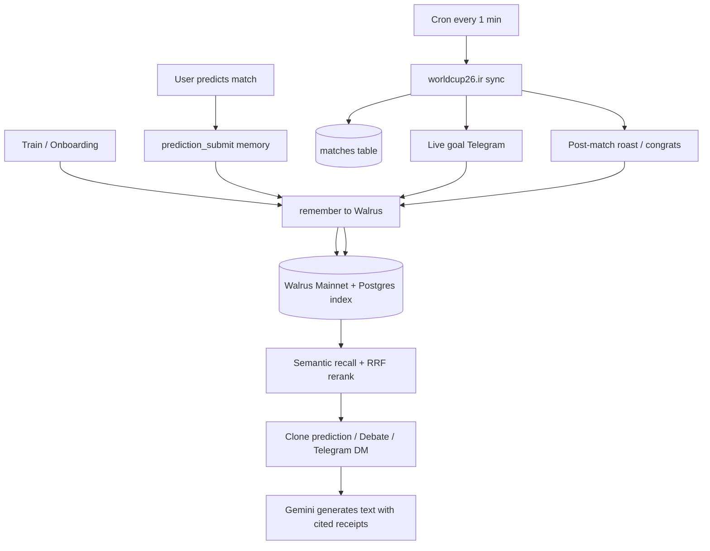
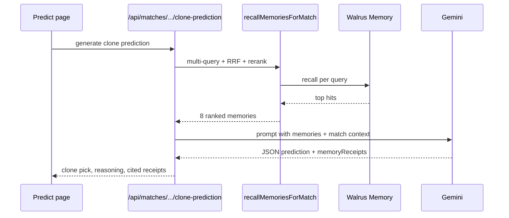

# How HoolClone Works

This document explains the full runtime loop: how the clone is trained, how Walrus memories are written and recalled, which algorithms rank memories, how match scores sync, and how Telegram notifications fit in.

For product vision and UX, see [project-overview.md](./project-overview.md). For full system design, see [hoolclone-architecture.md](./hoolclone-architecture.md).

---

## The closed loop (one picture)



**North star:** memories are not just logged — they are **recalled before every clone action** and shape what the agent says.

---

## 1. Training the clone

Training happens on `/train` through an onboarding interview.

### Flow

1. User answers questions (favorite team, rival, prediction style, heartbreaks, etc.).
2. `extractMemoryFromAnswer()` (Gemini) turns the raw answer into structured **facts**.
3. Each fact is written via `getMemoryAdapter().remember()` with `metadata.source: "onboarding"`.
4. Answers are also stored in Postgres (`onboarding_answers`) and folded into `fan_profiles.summary`.
5. Clone maturity increases with memory count (`syncCloneMaturity()`).

### Key files

| File | Role |
|------|------|
| `lib/onboarding/questions.ts` | Question bank |
| `lib/onboarding/service.ts` | Save answers + write memories |
| `lib/onboarding/extract-memory.ts` | LLM extraction of facts from free text |
| `app/(app)/train/page.tsx` | Training UI |

### What the clone knows after training

- **Fan profile:** `favorite_team`, `rival_team`, `preferred_style`, `summary`
- **Walrus memories:** bias, fan_profile, emotional_memory types from onboarding facts
- **Maturity label:** Level 0–4 based on memory count (`lib/auth/maturity.ts`)

---

## 2. Memory storage (Walrus + Postgres)

HoolClone uses a **hybrid** model:

| Layer | Stores |
|-------|--------|
| **Walrus (MemWal)** | Durable semantic blobs per user namespace `hoolclone:user:<id>` |
| **Postgres (`memories`)** | Index row: text, type, metadata, `walrusBlobId`, storage status |

### Write path (`remember`)

```
User action → MemoryAdapter.remember()
  → insertMemoryRow() in Postgres (status: pending)
  → memwal.rememberAndWait() → Walrus blob
  → update storage_status: stored + walrusBlobId
```

Implemented in `lib/memory/walrus-memory-adapter.ts`. If Walrus fails, the row stays `failed` and can be retried.

### Recall path (`recall`)

```
Query text → memwal.recall(namespace, query, limit: 6)
  → vector search returns blob IDs + distances
  → join back to Postgres rows by walrusBlobId
  → return text + score + metadata (type, source, createdAt, matchId)
```

On Walrus failure, falls back to Postgres keyword search (`recallMemoriesLocal`).

### Memory types and sources

| `metadata.source` | When written | Used for |
|-------------------|--------------|----------|
| `onboarding` | Train interview | Identity, biases, loyalty |
| `prediction_submit` | User locks a pick on `/predict` | This match's reasoning + scores |
| `clone_correction` | User corrects clone after disagreement | Overrides stale takes |
| `debate` | Debate correction | Argument style, trust |
| `telegram_live_goal` | Live goal Telegram DM | Recent live reactions |
| `telegram_post_match` | Post-match roast/congrats | Win/loss form |
| `match_resolution` | Cron after final whistle | Learning for all predictors |

Memory **types** (`memory_type` column): `remembered`, `fan_profile`, `bias`, `correction`, `prediction_pattern`, `prediction_history_summary`, `emotional_memory`, etc.

---

## 3. Memory recall algorithms

When the clone needs context (predict, debate, Telegram), it does **not** load all memories. It runs a multi-stage pipeline in `lib/clone/recall-memories.ts` and `lib/clone/memory-rerank.ts`.

### Step 1: Multi-query Walrus recall

For a match, the system fires ~8 semantic queries in parallel, e.g.:

- `"Argentina France World Cup prediction"`
- `"favorite team BRA loyalty bias"`
- `"prediction submit Tunisia Japan"`
- `"recent post match prediction outcome result"`

Each query returns up to 6 hits from Walrus vector search.

### Step 2: Reciprocal Rank Fusion (RRF)

Results from all query lists are merged with **RRF** (`k = 60`):

```
score(memory) += 1 / (k + rank_in_list)
```

Memories that appear in multiple query results rise to the top.

### Step 3: Reranking

Each memory gets a `finalScore` combining:

| Signal | What it does |
|--------|----------------|
| **Type weight** | Corrections (1.5×), prediction summaries (1.35×), fan_profile (1.0×) |
| **Source boost** | `prediction_submit` +0.10, `telegram_post_match` +0.12, `match_resolution` +0.12 |
| **Recency decay** | Exponential half-life per type (e.g. 45 days for predictions) |
| **Entity overlap** | Boost if memory text mentions match teams/codes |
| **Live match boost** | +0.15 when `metadata.matchId` equals current fixture |
| **Walrus distance** | Small boost from vector similarity score |

### Step 4: Diversity selection

`selectDiverseMemories()` picks up to **8** memories:

- Skips near-duplicates (Jaccard similarity > 0.72)
- Caps same-type memories (max 3 of one type)

### Telegram-specific recall

Telegram DMs use the same pipeline via `lib/telegram/recall-for-telegram-match.ts`:

- Calls `recallRankedMemoriesForMatch()` for the current fixture
- Adds live-context queries (goal reaction, why you picked X)
- **Pins** the user's `prediction_submit` memory for this match at rank 1 if it exists

---

## 4. Clone prediction

When you open a match on `/predict/[matchId]`:



### Important behaviors

- Clone predicts **before** seeing your pick (unless you already submitted).
- Prompt instructs Gemini to cite only recalled memory IDs — no fabrication.
- Weak memory (< 3 memories): clone asks a `trainingQuestion` instead of faking confidence.
- When **you** submit a pick, `rememberPredictionSubmission()` writes/updates a `prediction_submit` memory with your reasoning and emotion.

### Key files

| File | Role |
|------|------|
| `lib/clone/generate-clone-prediction.ts` | Orchestrator |
| `lib/clone/recall-memories.ts` | Recall pipeline |
| `lib/clone/remember-prediction.ts` | Write prediction memory on submit |
| `lib/prompts/clone-prediction.ts` | System prompt + weighting guidance |

---

## 5. Debate and corrections

On `/debate`, the clone argues using the same recall pipeline plus a **memory catalog** built for the session.

When you correct the clone:

1. `storeCloneCorrection()` writes a `correction` memory with `source: clone_correction`.
2. Corrections get the highest type weight (1.5×) in reranking.
3. Next clone prediction can pass `emphasizeCorrections: true` to add extra recall queries for corrections.

Contradiction detection (`lib/clone/contradiction-hunter.ts`) compares profile, prediction history, and memory texts — used heavily in **roasts**.

---

## 6. Match data and live scores

Match schedule is seeded from official WC 2026 fixtures (`lib/mock/matches.ts` → `npm run db:seed-matches`).

**Live scores** come from [worldcup26.ir](https://worldcup26.ir) (`GET /get/games`).

### Sync pipeline (`syncMatchResultsFromApi`)

Runs every **1 minute** via [cron-job.org](./cron-job.md) in production (and after `db:seed-matches` locally):

1. Fetch all games from worldcup26.ir
2. Match to Postgres rows by **`match_number`** (API `id: "36"` → `m036`)
3. Update `status`, `score_a`, `score_b`, `winner`
4. If score increased while match is **live**, record a `telegram_live_events` row

### Match status in UI

`lib/match-data/match-status.ts` resolves display status:

- Uses DB status when authoritative
- Without API sync, can infer live/final from kickoff time (no fake scores when API is configured)

### Key files

| File | Role |
|------|------|
| `lib/match-data/worldcup26-client.ts` | API client |
| `lib/match-data/sync-match-results.ts` | Sync + goal detection |
| `lib/match-data/football-team-map.ts` | API team names → FIFA codes |
| `app/api/cron/check-resolutions/route.ts` | Cron entrypoint |

---

## 7. Telegram bot

### Connecting

1. Web: `POST /api/telegram/link-token` → deep link `t.me/<bot>?start=link_<JWT>`
2. User taps Start in Telegram → `linkChatToUser()` binds `telegram_chats`
3. Notifications enabled by default after link

### Cron notification pipeline

Every minute (cron-job.org → `/api/cron/check-resolutions`), after score sync:

```
syncMatchResultsFromApi()
  → liveGoalEvents[]
  → processLiveGoalNotifications()   // live goals
  → processPostMatchNotifications()  // full-time roasts/congrats
  → processPostMatchResolutionMemories()  // learning for all predictors
```

### Live goal messages

**Who gets notified:**

- Telegram linked + notifications on
- AND (favorite team in match OR user predicted that match)

**How the message is built:**

1. `recallMemoriesForTelegramMatch()` — RRF + rerank + pin prediction memory
2. Gemini generates 1–2 sentences with `citedMemoryIds`
3. Citation enforcement validates IDs against the recalled set; invalid IDs are dropped with warnings
4. If recall is strong and citations are missing, the system enforces top memories (`citationSource: enforced`)
5. Receipt footer lists cited memories; full recalled snapshot is stored in `telegram_messages.metadata`
6. Store DM in `telegram_messages` + write a factual `telegram_live_goal` follow-up memory to Walrus

### Post-match messages

After `status = final` (kickoff within last 4 hours):

| Condition | Message |
|-----------|---------|
| Wrong pick or favorite lost | Roast (`buildRoastMessage`) |
| Correct pick or favorite won | Congrats (`buildCongratsMessage`) |

Roasts also use **contradiction hunting** over memory history.

### Telegram history

`/telegram-history` shows every sent DM with:

- **Recalled memories** — full ranked snapshot from Walrus recall at send time
- **Used in message** — citations that shaped the DM (LLM-chosen or system-enforced)
- **Recall backend** — `walrus`, `postgres_fallback`, or `none`
- **Citation source** — `llm` when the model cited valid IDs, `enforced` when the system filled gaps

On-demand `/roast` and `/roast m071` are persisted the same way as cron-driven messages.

### Key files

| File | Role |
|------|------|
| `lib/telegram/bot.ts` | grammy bot commands |
| `lib/telegram/live-goal-notify.ts` | Live goal pipeline |
| `lib/telegram/post-match-notify.ts` | Post-match pipeline |
| `lib/telegram/recall-for-telegram-match.ts` | Match-aware Walrus recall |
| `lib/telegram/citation-enforcement.ts` | Force memory citation |
| `lib/telegram/send-and-store.ts` | Persist outbound DMs |
| `app/(app)/telegram-history/page.tsx` | History UI |

---

## 8. Post-match learning (all users)

Even without Telegram, when a match goes final:

`processPostMatchResolutionMemories()` writes a `match_resolution` memory for **every user who predicted that match**, summarizing whether they were right or wrong.

These memories feed back into the next recall cycle with source boost +0.12.

---

## 9. Environment and operations

| Variable | Purpose |
|----------|---------|
| `DATABASE_URL` | Postgres (Supabase) |
| `MEMORY_BACKEND` | `walrus` or `local` |
| `MEMWAL_ACCOUNT_ID` / `MEMWAL_DELEGATE_PRIVATE_KEY` | Walrus Memory credentials |
| `GEMINI_API_KEY` | Clone, debate, Telegram message generation |
| `TELEGRAM_BOT_TOKEN` | Telegram bot |
| `CRON_SECRET` | Authorize `/api/cron/check-resolutions` (cron-job.org sends `Authorization: Bearer …`) |
| `WORLDCUP26_BASE_URL` | Optional; defaults to `https://worldcup26.ir` |

### Useful commands

```bash
npm run db:seed-matches    # Seed fixtures + sync scores from API
npm run db:migrate         # Apply schema (incl. telegram_messages tables)
npm run verify:mainnet     # Verify Walrus blobs on Mainnet

# Dev: manual score sync
curl -X POST http://localhost:3000/api/admin/sync-matches

# Prod: manual sync with cron secret
curl "https://your-app.vercel.app/api/cron/check-resolutions" \
  -H "Authorization: Bearer $CRON_SECRET"
```

Production scheduler setup: [cron-job.md](./cron-job.md).

```bash
# Prod: admin-only score sync (alternative to cron endpoint)
curl -X POST https://your-app.vercel.app/api/admin/sync-matches \
  -H "Authorization: Bearer $CRON_SECRET"
```

---

## 10. Quick reference: user journey

| User action | Memory written | Who recalls it next |
|-------------|----------------|---------------------|
| Answer train question | `onboarding` facts | Clone predict, debate, Telegram |
| Submit match prediction | `prediction_submit` | Clone, live Telegram (pinned), post-match |
| Correct clone in debate | `clone_correction` | Next predict (high weight) |
| Receive live goal DM | `telegram_live_goal` | Next live DM, predict |
| Match ends (Telegram user) | `telegram_post_match` | Next predict, roast/congrats |
| Match ends (any predictor) | `match_resolution` | Next predict |

---

## 11. Related docs

- [Architecture](./hoolclone-architecture.md) — full technical spec
- [Product design](./product-design.md) — screens and UX
- [Implementation plan](./implementation-plan.md) — build milestones
- [README](../README.md) — setup and demo links
