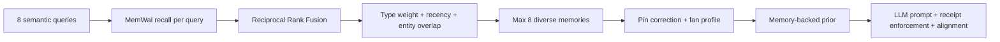

# How Walrus Memory Is Used

This page traces **where Walrus memory is written and recalled** across every HoolClone flow. For namespaces, write/recall internals, and SDK setup, see [Walrus Memory](./walrus-memory.md). For why memory changes clone behavior, see [How Memory Improves the Agent](./how-memory-improves-agent.md).

---

## The rule

Every clone action follows the same pattern:

```text
User action → remember() → Walrus blob + Postgres index
Later action → recall() → ranked memories → LLM prompt with receipts
```

Memory is **not** a log you browse later — it is **input to the agent** on the next turn.

---

## Flow-by-flow usage

### Train (`/train`)

| Step | Walrus |
|------|--------|
| User answers onboarding question | `extractMemoryFromAnswer()` → one or more `remember()` calls per fact |
| `emotional_memory` facts | Encrypted on Walrus (`enc:v1:`) with `searchText` surrogate for clone recall |
| Metadata | `source: onboarding`, types: `fan_profile`, `bias`, `emotional_memory` |
| Namespace | `hoolclone:user:<userId>` |
| Recall later? | Yes — fan identity, loyalty, rivals, prediction style |

**Key files:** `lib/onboarding/service.ts`, `lib/onboarding/extract-memory.ts`

After ~3 memories, maturity rises from **Level 0 Stranger** to **Level 1 Learner**.

---

### Predict (`/predict`)

| Step | Walrus |
|------|--------|
| User locks match pick | `rememberPredictionSubmission()` → `prediction_pattern` memory |
| User requests clone prediction | `recallMemoriesForMatch()` → 8 parallel semantic queries → RRF → rerank → top 8 |
| Clone generates answer | Gemini prompt includes ranked memories; output includes `memoryReceipts` |
| User corrects clone | `storeCloneCorrection()` → `correction` memory; optional regenerate with `emphasizeCorrections: true` |

**Important:** Clone recall **excludes** the user's pick for the current fixture (`excludeCurrentMatchPick`) so the clone predicts from habits, not cheating.

**Corrections vs fixtures:** A correction from an earlier match (e.g. Panama vs Croatia) can still be **recalled and cited** when either team appears again (Croatia vs Ghana). That is intentional — team-level lessons carry forward. The **Teach your clone** panel, however, only shows **Successfully taught** when a correction was stored for **this exact fixture** (`metadataMatchId` or parsed `Match:` label via `isCloneCorrectionForMatch()`). Cross-fixture receipts must not mark a new match as already trained.

**Key files:** `lib/clone/recall-memories.ts`, `lib/clone/generate-clone-prediction.ts`, `lib/clone/remember-prediction.ts`, `lib/clone/store-clone-correction.ts`, `lib/clone/clone-memory-receipts.ts`, `components/match/clone-correction-panel.tsx`

UI shows each receipt with recall source: **Walrus: Verified recall** or **Postgres fallback recall**.

---

### Debate (`/debate`)

| Step | Walrus |
|------|--------|
| User sends message | `buildDebateMemoryCatalog()` recalls memories relevant to the argument |
| Clone replies | Cites memory receipts; `contradiction-hunter` may surface self-image vs behavior gaps |
| User corrects during debate | `correction` memory with `source: debate` |

Debate uses the same namespace and recall adapter as predict, with extra queries from the user's message and recent debate turns.

**Key files:** `lib/debate/build-debate-memory-catalog.ts`, `lib/debate/analyze-debate.ts`

---

### Post-match & cron

| Step | Walrus |
|------|--------|
| Match finalizes | `processPostMatchResolutionMemories()` writes `prediction_history_summary` per predictor |
| Cron every 1 min | `GET /api/cron/check-resolutions` syncs scores, live goals, post-match loop |
| Metadata | `source: match_resolution` or `telegram_post_match` |

These memories get **high rerank weight** on the next predict/debate (`telegram_post_match` +0.12, type weight 1.35× for prediction summaries).

**Key files:** `lib/clone/post-match-resolution.ts`, `app/api/cron/check-resolutions/route.ts`

---

### Sleep-cycle consolidation (cron every 6h)

| Step | Walrus |
|------|--------|
| Cron fires | `GET /api/cron/memory-consolidation` clusters repetitive prediction memories |
| Synthesis | LLM writes one `consolidated_bias` blob per cluster |
| Archive | Superseded Postgres rows marked `archived`; originals stay on Mainnet |
| Recall later? | Yes — `consolidated_bias` gets boosted rerank weight |

**Key files:** `lib/memory/consolidate-memories.ts`, `lib/memory/memory-filters.ts`

---

### Memory browser & unlock (`/memory`)

| Step | Walrus |
|------|--------|
| List memories | Postgres index; encrypted rows show lock badge |
| Unlock emotional memory | Wallet signs challenge → server decrypts for UI only |
| Clone recall | Uses `searchText` surrogate — never needs unlock |

**Key files:** `app/(app)/memory/page.tsx`, `lib/crypto/memory-crypto.ts`, `app/api/memories/decrypt/route.ts`

---

### Telegram bot

| Step | Walrus |
|------|--------|
| `/roast` | Recalls memories → Gemini roast with citations |
| `/predict m071` | Recalls memories → shows user pick + clone pick with receipts |
| Live goal alert | `remember()` with `source: telegram_live_goal` |
| Post-match DM (win/loss) | Congrats or roast DM + `remember()` with `source: telegram_post_match`, `public_visible: false` |

Citation enforcement drops invalid memory IDs; if recall is strong but citations missing, top memories can be forced into the reply.

**Key files:** `lib/telegram/citation-enforcement.ts`, `lib/telegram/recall-for-telegram-match.ts`

---

### Public profile & evolution (`/u/<slug>`)

| Step | Walrus |
|------|--------|
| Memory cards | Display `walrusBlobId`, storage status, provenance labels |
| Evolution page | `buildMemoryTimeMachine()` reconstructs day-by-day clone state from stored memories |
| Judge panels | `buildSameQuestionProofFromTimeMachine()`, correction override, roast record |

Evolution is **reconstructed from memories**, not replayed LLM session logs — honest about what is derived vs live.

**Key files:** `lib/clone/build-memory-time-machine.ts`, `lib/clone/judge-proof-demo.ts`

---

### Clone Clash (`/u/<slug>/clash`)

Two users, two namespaces. Each side recalls only from its own `hoolclone:user:<id>` (demo: `hoolclone:demo:hoolclone-demo` vs `hoolclone:demo:hoolclone-rival`). Cross-user debate without shared memory — proves namespace isolation.

---

## Recall pipeline (summary)

When any clone action needs context:



| Signal | Effect |
|--------|--------|
| `correction` type | 1.5× weight; emphasized after user correction |
| `telegram_post_match` | +0.12 source boost |
| Entity overlap with match teams | Boost |
| Fixture correction / fan profile | Pinned into final 8 after diversity |
| Memory-backed prior | Injected into prompt; strong prior can override LLM winner |
| Recency | Exponential decay per memory type |
| Near-duplicate text | Skipped (Jaccard > 0.72) |

Full detail: [Walrus Memory → Recall pipeline](./walrus-memory.md#recall-pipeline-clone-actions).

---

## Write triggers (quick reference)

| Trigger | `metadata.source` | Memory type |
|---------|-------------------|-------------|
| Train answer | `onboarding` | `fan_profile`, `bias`, `emotional_memory` |
| Match pick submitted | `prediction_submit` | `prediction_pattern` |
| Clone correction | `clone_correction` | `correction` |
| Debate correction | `debate` | `correction` |
| Live goal DM | `telegram_live_goal` | `emotional_memory` |
| Post-match Telegram | `telegram_post_match` | `prediction_history_summary` |
| Match finalized | `match_resolution` | `prediction_history_summary` |

---

## Hybrid storage model

| Layer | Role |
|-------|------|
| **Walrus (MemWal)** | Durable semantic blobs, vector search, Mainnet proof |
| **Postgres (`memories`)** | Fast UI queries, joins, `walrusBlobId` index, storage status |

If Walrus recall fails, Postgres keyword search runs as fallback — the UI labels this explicitly.

---

## Demo vs production

| Command | Blob IDs |
|---------|----------|
| `npm run db:seed-demo` | `demo-blob-*` placeholders (local UI only) |
| `npm run db:seed-demo-walrus` | Real Mainnet IDs (judging) |
| `npm run db:seed-demo-rival-walrus` | Real Mainnet IDs (Clone Clash) |

Verify before demo: `npm run verify:mainnet`

---

## Related docs

- [How Memory Improves the Agent](./how-memory-improves-agent.md) — behavioral impact
- [Walrus Memory](./walrus-memory.md) — technical reference
- [Judges Guide](./judges.md) — what to click in production
- [How It Works](./how-it-works.md) — full runtime loop
