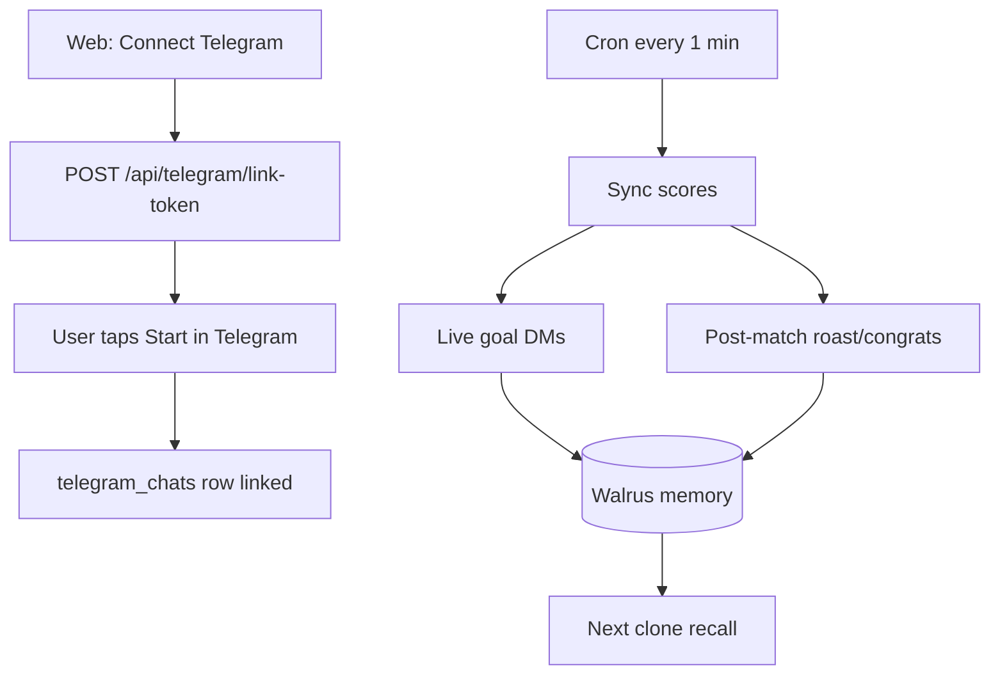

# Telegram Bot

HoolClone extends beyond the browser with a **grammy**-powered Telegram bot. Users connect in one tap from the web, receive live goal alerts and post-match roasts/congrats, and every outbound message writes structured memories back to Walrus — closing the loop for the next clone prediction.

---

## Overview



---

## Connecting (web → Telegram)

### One-tap deep link (recommended)

After training (or from the dashboard with 3+ memories), tap **Connect Telegram**:

```
POST /api/telegram/link-token  →  https://t.me/<bot>?start=link_<JWT>
```

User taps **Start** in Telegram. The bot:

1. Links `telegram_chats` to the wallet user
2. Enables notifications by default
3. Confirms with evolution page link if profile is public

### Check link status

```
GET /api/telegram/status  →  { linked, notificationsEnabled }
```

### Manual fallback commands

```
/start link_<token>   — complete web-issued deep link
/link <wallet>        — manual wallet binding
/verify <signature>   — complete link with Sui signature
```

---

## Bot commands

| Command | Description |
|---------|-------------|
| `/start` | Welcome; `/start link_<token>` completes web connect |
| `/link <wallet>` | Manual wallet binding fallback |
| `/verify <sig>` | Complete link with Sui signature |
| `/roast` | Get roasted using stored memories |
| `/roast m071` | Roast scoped to a specific match |
| `/predict m071` | Your pick + clone pick with receipts |
| `/notifications on\|off` | Toggle match alerts |
| `/unlink` | Revoke chat binding |

---

## Notification pipeline

[cron-job.org](https://cron-job.org) calls `GET /api/cron/check-resolutions` every minute. After score sync:

```
syncMatchResultsFromApi()
  → liveGoalEvents[]
  → processLiveGoalNotifications()
  → processPostMatchNotifications()
  → processPostMatchResolutionMemories()
```

Setup: [Production Cron](./cron-job.md).

---

## Live goal messages

**Who receives them:**

- Telegram linked + notifications on
- AND (favorite team in match OR user predicted that match)

**How messages are built:**

1. `recallMemoriesForTelegramMatch()` — RRF + rerank + pin user's `prediction_submit` memory
2. Gemini generates 1–2 sentences with `citedMemoryIds`
3. Citation enforcement validates IDs; invalid IDs dropped with warnings
4. If recall is strong but citations missing, system enforces top memories
5. DM stored in `telegram_messages` + factual `telegram_live_goal` memory written to Walrus

---

## Post-match messages

After `status = final` (kickoff within last 4 hours):

| Condition | Message type |
|-----------|--------------|
| Wrong pick or favorite lost | **Roast** (`buildRoastMessage`) |
| Correct pick or favorite won | **Congrats** (`buildCongratsMessage`) |

| Outcome | Telegram DM | Walrus write |
|---------|-------------|--------------|
| Win | Congrats (cites memories) | `prediction_history_summary`, `source: telegram_post_match`, `outcome: win` |
| Loss | Roast (cites memories) | Same structure with `outcome: loss` |

The DM is ephemeral; the Walrus memory is private (`public_visible: false`). On the next web prediction, `recall()` weights post-match summaries heavily.

Roasts use **contradiction hunting** (`lib/clone/contradiction-hunter.ts`) over memory history.

---

## Telegram history page

`/telegram-history` shows every sent DM with:

| Field | Meaning |
|-------|---------|
| **Recalled memories** | Full ranked snapshot from Walrus at send time |
| **Used in message** | Citations that shaped the DM |
| **Recall backend** | `walrus`, `postgres_fallback`, or `none` |
| **Citation source** | `llm` or `enforced` |

On-demand `/roast` commands are persisted the same way as cron-driven messages.

---

## Environment variables

```env
TELEGRAM_BOT_TOKEN=          # From @BotFather
TELEGRAM_BOT_USERNAME=        # Without @
CRON_SECRET=                  # Cron auth (also used by webhook security)
```

### Register webhook

```bash
CRON_APP_URL=https://walrus-mu.vercel.app npm run telegram:webhook
```

Webhook endpoint: `POST /api/telegram/webhook`

---

## Key source files

| File | Role |
|------|------|
| `lib/telegram/bot.ts` | grammy bot commands |
| `lib/telegram/live-goal-notify.ts` | Live goal pipeline |
| `lib/telegram/post-match-notify.ts` | Post-match pipeline |
| `lib/telegram/recall-for-telegram-match.ts` | Match-aware Walrus recall |
| `lib/telegram/citation-enforcement.ts` | Force memory citation |
| `lib/telegram/send-and-store.ts` | Persist outbound DMs |
| `app/api/telegram/webhook/route.ts` | Webhook handler |
| `app/(app)/telegram-history/page.tsx` | History UI |

---

## LLM fallback

When `GEMINI_API_KEY` is unset or rate-limited, Telegram uses template fallbacks for roasts/congrats. Walrus memory writes still occur; only the DM text quality degrades.

---

## Related docs

- [How It Works](./how-it-works.md) — §7 Telegram, §8 post-match learning
- [Production Cron](./cron-job.md) — scheduler setup
- [Deployment](./deployment.md) — Vercel env vars
- [Walrus Memory](./walrus-memory.md) — memory types and recall
