# Test Coverage

Map of **194 unit tests** across **47 files** to HoolClone user flows and submission-critical logic. Run `npm test` to verify — no external services required.

For how to run tests and write new ones, see [Testing](./testing.md).

---

## Summary

| Metric | Value |
|--------|-------|
| Test files | 47 (`lib/**/*.test.ts`) |
| Test cases | 194 |
| Test suites | 91 |
| Runner | Node `node:test` + `tsx` |
| E2E / API route tests | None (by design) |

---

## Flow coverage matrix

| User flow | What's tested | Test files |
|-----------|---------------|------------|
| **Train / onboarding** | Maturity levels, memory extraction fallback, profile hints | `lib/auth/maturity.test.ts`, `lib/onboarding/extract-memory.test.ts` |
| **Predict** | Alignment, agreement, exclude own pick from recall, fallback clone, post-match text, clone receipt filtering | `lib/clone/prediction-*.test.ts`, `lib/clone/fallback-clone-prediction.test.ts`, `lib/clone/post-match-resolution.test.ts`, `lib/clone/clone-memory-receipts.test.ts`, `lib/predictions/predicted-match-ids.test.ts` |
| **Recall / Walrus** | RRF, diversity, type weights, recency, entity overlap, blob parse, provenance, consolidation, encryption envelopes | `lib/clone/memory-rerank.test.ts`, `lib/clone/memory-provenance.test.ts`, `lib/walrus/parse-blob-payload.test.ts`, `lib/memory/recall-provenance.test.ts`, `lib/memory/consolidate-memories.test.ts`, `lib/crypto/memory-crypto.test.ts` |
| **Debate** | Full pipeline: intent → analyze → rank → align → cite → contradict → fallback | 11 files under `lib/debate/*.test.ts` |
| **Telegram** | Citation enforcement, pin prediction memory, share cards, snapshots, follow-up memory | `lib/telegram/*.test.ts` (5 files) |
| **Cron / matches** | Match status, team code mapping, sync-on-read | `lib/match-data/match-status.test.ts`, `lib/match-data/football-team-map.test.ts`, `lib/match-data/sync-match-results.test.ts` |
| **Public profile / dashboard** | Contradictions, temporal drift, bias radar, clone mood, judge-proof panels | `lib/clone/contradiction-hunter.test.ts`, `lib/clone/temporal-contradictions.test.ts`, `lib/stats/bias-radar.test.ts`, `lib/clone/clone-mood.test.ts`, `lib/clone/judge-proof-demo.test.ts` |
| **Auth** | Wallet challenge JWT round-trip, memory unlock challenge | `lib/auth/wallet-challenge.test.ts` |
| **API shaping** | Memory receipt mapper, lineage | `lib/api/memory-mapper.test.ts` |

---

## All test files

### Debate pipeline (11 files · ~47 tests)

| File | Functions / behavior covered |
|------|------------------------------|
| [`lib/debate/extract-entities.test.ts`](../lib/debate/extract-entities.test.ts) | `extractSearchTerms`, `extractDebateEntities`, `pickReceiptsBySearchTerms`, `isCorrectionReceipt` |
| [`lib/debate/score-memory-relevance.test.ts`](../lib/debate/score-memory-relevance.test.ts) | `scoreMemoryRelevance`, `rankMemoriesForTurn` |
| [`lib/debate/analyze-debate-turn.test.ts`](../lib/debate/analyze-debate-turn.test.ts) | `analyzeDebateTurn` — topics, dispute, denial, winner claims |
| [`lib/debate/parse-user-intent.test.ts`](../lib/debate/parse-user-intent.test.ts) | `parseDebateUserIntent`, `shouldUseSpecializedDebateReply` — head-to-head, favorite switches |
| [`lib/debate/infer-citations.test.ts`](../lib/debate/infer-citations.test.ts) | `inferCitedReceipts` — UUID and `#N` refs |
| [`lib/debate/align-citations.test.ts`](../lib/debate/align-citations.test.ts) | `alignCitationsToTurn` |
| [`lib/debate/filter-contradictions.test.ts`](../lib/debate/filter-contradictions.test.ts) | `filterDebateContradictions` |
| [`lib/debate/fallback-debate-reply.test.ts`](../lib/debate/fallback-debate-reply.test.ts) | `buildFallbackDebateReply` |
| [`lib/debate/specialized-replies.test.ts`](../lib/debate/specialized-replies.test.ts) | `trySpecializedDebateReply` |
| [`lib/debate/thread-variation.test.ts`](../lib/debate/thread-variation.test.ts) | `isRepeatingReply`, `pickContradictionForTurn` |
| [`lib/debate/prediction-rebuttal.test.ts`](../lib/debate/prediction-rebuttal.test.ts) | `findPredictionRebuttal` |

### Clone & memory recall (12 files · ~52 tests)

| File | Functions / behavior covered |
|------|------------------------------|
| [`lib/clone/memory-rerank.test.ts`](../lib/clone/memory-rerank.test.ts) | `typeWeight`, `recencyBoost`, `entityOverlapBoost`, `reciprocalRankFusion`, `selectDiverseMemories`, `rerankMemoriesForMatch`, `consolidated_bias` boost |
| [`lib/clone/prediction-memory-filter.test.ts`](../lib/clone/prediction-memory-filter.test.ts) | `isCurrentMatchSubmittedPick` |
| [`lib/clone/contradiction-hunter.test.ts`](../lib/clone/contradiction-hunter.test.ts) | `huntContradictions`, `pickDashboardContradiction` |
| [`lib/clone/temporal-contradictions.test.ts`](../lib/clone/temporal-contradictions.test.ts) | `detectTemporalContradictions`, `computeConsistencyScore` |
| [`lib/clone/fallback-clone-prediction.test.ts`](../lib/clone/fallback-clone-prediction.test.ts) | `fallbackClonePrediction` — weak memory + loyalty/rival |
| [`lib/clone/post-match-resolution.test.ts`](../lib/clone/post-match-resolution.test.ts) | `buildPostMatchResolutionMemoryText` |
| [`lib/clone/prediction-alignment.test.ts`](../lib/clone/prediction-alignment.test.ts) | `computePredictionAlignment`, `averagePredictionAlignment` |
| [`lib/clone/prediction-agreement.test.ts`](../lib/clone/prediction-agreement.test.ts) | `predictionsAgree` |
| [`lib/clone/clone-mood.test.ts`](../lib/clone/clone-mood.test.ts) | `computeCloneMood` |
| [`lib/clone/judge-proof-demo.test.ts`](../lib/clone/judge-proof-demo.test.ts) | `buildSameQuestionProofFromTimeMachine`, `buildCorrectionOverrideFromProfile`, `buildRoastRecordFromProfile` |
| [`lib/clone/memory-provenance.test.ts`](../lib/clone/memory-provenance.test.ts) | `formatMemorySourceLabel`, `formatProvenanceLabel` |
| [`lib/clone/clone-memory-receipts.test.ts`](../lib/clone/clone-memory-receipts.test.ts) | `memoryRelevantToMatch`, `buildStoredCloneReceipts`, `pickInfluentialReceiptsForFallback` |

### API & Walrus (5 files · ~20 tests)

| File | Functions / behavior covered |
|------|------------------------------|
| [`lib/api/memory-mapper.test.ts`](../lib/api/memory-mapper.test.ts) | `storedMemoryToReceipt`, `storedMemoriesToReceipts` |
| [`lib/walrus/parse-blob-payload.test.ts`](../lib/walrus/parse-blob-payload.test.ts) | `parseBlobPayload`, `tokenizeBlobPayload`, encrypted `enc:v1:` envelopes |
| [`lib/memory/recall-provenance.test.ts`](../lib/memory/recall-provenance.test.ts) | `recallSourceFromMetadata` |
| [`lib/memory/consolidate-memories.test.ts`](../lib/memory/consolidate-memories.test.ts) | Sleep-cycle clustering, `archiveMemories`, consolidation synthesis |
| [`lib/crypto/memory-crypto.test.ts`](../lib/crypto/memory-crypto.test.ts) | HKDF key derivation, encrypt/decrypt round-trip for emotional memories |

### Clone Clash, evolution & leaderboard (4 files · ~12 tests)

| File | Functions / behavior covered |
|------|------------------------------|
| [`lib/clash/arena-opponents.test.ts`](../lib/clash/arena-opponents.test.ts) | Arena opponent selection and namespace pairing |
| [`lib/evolution/build-evolution-chat.test.ts`](../lib/evolution/build-evolution-chat.test.ts) | Evolution chat transcript builders |
| [`lib/leaderboard/compute-learning-score.test.ts`](../lib/leaderboard/compute-learning-score.test.ts) | Learning score from prediction history |
| [`lib/match/team-text-tokens.test.ts`](../lib/match/team-text-tokens.test.ts) | Team name tokenization for recall queries |

### Telegram (7 files · ~28 tests)

| File | Functions / behavior covered |
|------|------------------------------|
| [`lib/telegram/citation-enforcement.test.ts`](../lib/telegram/citation-enforcement.test.ts) | `enforceCitationInMessage` — LLM vs enforced citations |
| [`lib/telegram/recall-for-telegram-match.test.ts`](../lib/telegram/recall-for-telegram-match.test.ts) | `pinPredictionMemory`, `primaryRecallSource` |
| [`lib/telegram/recall-for-telegram.test.ts`](../lib/telegram/recall-for-telegram.test.ts) | General Telegram recall helpers |
| [`lib/telegram/link-token.test.ts`](../lib/telegram/link-token.test.ts) | Deep-link JWT for bot connect |
| [`lib/telegram/parse-share-card.test.ts`](../lib/telegram/parse-share-card.test.ts) | `parseMatchLabel`, `primaryQuoteFromBody`, `splitQuoteHighlight` |
| [`lib/telegram/recalled-memory-snapshot.test.ts`](../lib/telegram/recalled-memory-snapshot.test.ts) | `excerptMemoryText`, `toRecalledMemorySnapshots`, `parseRecalledMemorySnapshots` |
| [`lib/telegram/telegram-follow-up-memory.test.ts`](../lib/telegram/telegram-follow-up-memory.test.ts) | `buildLiveGoalFollowUpMemoryText`, `buildPostMatchFollowUpMemoryText` |

### Auth & onboarding (3 files · ~13 tests)

| File | Functions / behavior covered |
|------|------------------------------|
| [`lib/auth/maturity.test.ts`](../lib/auth/maturity.test.ts) | `memoryCountToMaturity`, `maturityLevelToLabel`, `computeMaturityProgress` |
| [`lib/auth/wallet-challenge.test.ts`](../lib/auth/wallet-challenge.test.ts) | `createWalletChallenge`, `verifyWalletChallengeToken` |
| [`lib/onboarding/extract-memory.test.ts`](../lib/onboarding/extract-memory.test.ts) | `fallbackExtraction` |

### Match data & stats (4 files · ~18 tests)

| File | Functions / behavior covered |
|------|------------------------------|
| [`lib/match-data/match-status.test.ts`](../lib/match-data/match-status.test.ts) | `effectiveMatchStatus`, kickoff inference |
| [`lib/match-data/football-team-map.test.ts`](../lib/match-data/football-team-map.test.ts) | `apiTeamNameToCode`, `codesMatchFixture` |
| [`lib/match-data/sync-match-results.test.ts`](../lib/match-data/sync-match-results.test.ts) | `findDbMatch` — team-only sync matching |
| [`lib/stats/bias-radar.test.ts`](../lib/stats/bias-radar.test.ts) | `extractMemoryDrivers`, `hasBiasRadarData`, `buildBiasRadar` |

### Predictions (1 file · ~2 tests)

| File | Functions / behavior covered |
|------|------------------------------|
| [`lib/predictions/predicted-match-ids.test.ts`](../lib/predictions/predicted-match-ids.test.ts) | Predicted match id merge and case-insensitive lookup |

---

## Judging criteria → test proof

| Judging signal | Unit test proof | Manual / prod proof |
|----------------|-----------------|---------------------|
| Memory drives clone behavior | `memory-rerank`, `recall-provenance`, `citation-enforcement` | Expand receipts on `/predict` |
| Clone cites real memories | `infer-citations`, `align-citations`, `enforceCitationInMessage` | `/telegram-history` recall snapshots |
| Contradictions & evolution | `contradiction-hunter`, `temporal-contradictions`, `judge-proof-demo` | `/u/hoolclone-demo/evolution` |
| Maturity over time | `maturity`, `fallback-clone-prediction` | Train → predict flow |
| Walrus Mainnet blobs | `parse-blob-payload`, `memory-mapper`, `recall-provenance`, `memory-crypto` | `npm run verify:mainnet` |
| Post-match learning loop | `post-match-resolution`, `telegram-follow-up-memory`, `consolidate-memories` | Cron + Telegram DMs |
| Private emotional memories | `memory-crypto`, encrypted blob parse | `/memory` unlock flow |

---

## Intentional gaps

These are **not** covered by unit tests and require other verification:

```mermaid
flowchart LR
  subgraph unitTests [Unit tests lib/]
    Pure[Pure logic]
    Fallback[Offline fallbacks]
  end

  subgraph manual [Manual / prod]
    Mainnet[verify:mainnet]
    Demo[Demo video]
    Walrus[Live Walrus recall]
  end

  unitTests --> Judges[Judging narrative]
  manual --> Judges
```

| Gap | Why | How to verify |
|-----|-----|---------------|
| API routes | Thin wrappers | Integration via app + `npm test` on lib |
| MemWal writes/recall | External service | `verify:mainnet`, MemWal health endpoint |
| Gemini output quality | Non-deterministic | Demo with API key set |
| Full user E2E | Out of scope | [Demo Guide](./demo-guide.md) script |
| `lib/match-data/mapper.test.ts` | Not yet added | Team map + match-status cover sync inputs |

---

## Related docs

- [Testing](./testing.md) — run tests, conventions, fixtures
- [Getting Started](./getting-started.md) — submission checklist
- [Architecture §18](./hoolclone-architecture.md) — testing strategy
- [Demo Guide](./demo-guide.md) — manual judge walkthrough
