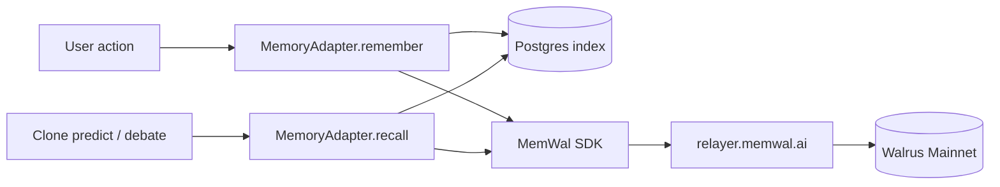

# Walrus Memory

HoolClone stores every fan take, prediction, correction, and post-match summary as **durable semantic memory** on Walrus Mainnet via the [MemWal SDK](https://docs.memwal.ai). Memory is not a log file — it is **recalled before every clone action** and shapes predictions, debates, and Telegram roasts.

---

## Why memory is the product

| Property | What it means in HoolClone |
|----------|---------------------------|
| **Durable** | Fan takes survive across sessions, browsers, and devices |
| **Verifiable** | Each receipt shows a real `walrusBlobId` on Mainnet |
| **Behavioral** | Clone `recall()` pulls memories before generating output |
| **Evolving** | Corrections and post-match summaries append new blobs |
| **Inspectable** | Judges expand memory cards to see Walrus proof |

> HoolClone is not predicting football. It is predicting you.

---

## Architecture overview



HoolClone uses a **hybrid** model:

| Layer | Stores |
|-------|--------|
| **Walrus (MemWal)** | Durable semantic blobs per user namespace |
| **Postgres (`memories`)** | Index: text, type, metadata, `walrusBlobId`, storage status |

Postgres enables fast UI queries and joins; Walrus provides vector search and Mainnet durability.

---

## Namespaces

Each user gets an isolated namespace:

```text
hoolclone:user:<userId>
```

Demo accounts use:

```text
hoolclone:demo:hoolclone-demo
hoolclone:demo:hoolclone-rival
```

Never mix users in one namespace — the clone's identity depends on clean boundaries.

---

## Write path (`remember`)

```
User action → MemoryAdapter.remember()
  → insertMemoryRow() in Postgres (status: pending)
  → memwal.rememberAndWait() → Walrus blob
  → update storage_status: stored + walrusBlobId
```

**Key file:** `lib/memory/walrus-memory-adapter.ts`

If Walrus write fails, the row stays `failed` and can be retried via `POST /api/memories/retry` or `npm run db:retry-failed-demo-walrus`.

---

## Recall path (`recall`)

```
Query text → memwal.recall(namespace, query, limit: 6)
  → vector search returns blob IDs + distances
  → join back to Postgres rows by walrusBlobId
  → return text + score + metadata
```

On Walrus failure, falls back to Postgres keyword search. The UI shows this explicitly:

- **Walrus: Verified recall** — vector search succeeded
- **Postgres fallback recall** — Walrus unavailable

Archived memories (`archived`, `superseded`) are excluded from recall and maturity counts.

---

## Selective encryption (emotional memories)

Only **`emotional_memory`** facts from onboarding are encrypted at write time. Other memory types remain plaintext on Walrus for vector search.

| Layer | What's stored |
|-------|----------------|
| **Walrus blob** | `enc:v1:` ciphertext + public `search:"..."` surrogate for semantic recall |
| **Postgres index** | Encrypted text column; UI shows lock badge until unlocked |
| **Clone recall** | Uses `searchText` surrogate — clone never needs wallet unlock |

### Unlock flow (`/memory`)

1. User requests `POST /api/auth/memory-challenge` → signs unlock message with wallet
2. `POST /api/memories/decrypt` verifies signature and returns plaintext for UI only
3. Decrypted text is **not** sent to clone prompts — recall continues via surrogates

**Key files:** `lib/crypto/memory-crypto.ts`, `lib/crypto/walrus-envelope.ts`, `lib/wallet/use-memory-unlock.ts`

---

## Sleep-cycle consolidation

Every **6 hours**, `GET /api/cron/memory-consolidation` runs a "sleep cycle" that:

1. Clusters repetitive `prediction_pattern` and `prediction_history_summary` memories
2. Synthesizes a single `consolidated_bias` memory via LLM
3. Archives superseded rows (`metadata.archived: true`) — Walrus blobs stay immutable

Consolidated biases get a rerank boost (`consolidated_bias` type weight) and appear in memory lineage on `/memory`.

**Key files:** `lib/memory/consolidate-memories.ts`, `app/api/cron/memory-consolidation/route.ts`

Manual demo: `npm run consolidate:demo`

---

## When memories are written

| Trigger | `metadata.source` | Memory types |
|---------|-------------------|--------------|
| Train interview answer | `onboarding` | `fan_profile`, `bias`, `emotional_memory` |
| User locks a match pick | `prediction_submit` | `prediction_pattern` |
| User corrects clone | `clone_correction` | `correction` |
| Debate correction | `debate` | `correction` |
| Live goal Telegram DM | `telegram_live_goal` | `emotional_memory` |
| Post-match roast/congrats | `telegram_post_match` | `prediction_history_summary` |
| Match finalizes (any predictor) | `match_resolution` | `prediction_history_summary` |
| Sleep-cycle cron (every 6h) | `sleep_cycle` | `consolidated_bias` (archives clustered sources) |

---

## Recall pipeline (clone actions)

Before generating a clone prediction, debate reply, or Telegram message, HoolClone runs a multi-stage pipeline in `lib/clone/recall-memories.ts`:

### 1. Multi-query Walrus recall

~8 semantic queries fire in parallel (team names, loyalty, recent post-match outcomes, etc.). Each returns up to 6 hits.

### 2. Reciprocal Rank Fusion (RRF)

Results merge with `score += 1 / (k + rank)` where `k = 60`. Memories appearing in multiple query lists rise to the top.

### 3. Reranking

Each memory gets a `finalScore` from:

| Signal | Effect |
|--------|--------|
| Type weight | Corrections 1.5×, prediction summaries 1.35×, consolidated_bias 1.4× |
| Source boost | `telegram_post_match` +0.12, `match_resolution` +0.12 |
| Recency decay | Exponential half-life per type |
| Entity overlap | Boost when text mentions match teams |
| Live match boost | +0.15 when `metadata.matchId` matches current fixture |
| Walrus distance | Small boost from vector similarity |

### 4. Diversity selection

Up to **8** memories selected; near-duplicates skipped (Jaccard > 0.72), max 3 of same type.

---

## Memory receipts

A **memory receipt** is user-visible proof of why the clone behaved a certain way:

```text
Receipt: You previously picked Portugal because you trust late individual
brilliance in close matches. (fan_profile · 3 days ago · blob 3pZ8…kL9m)
```

Receipts must map to **recalled** memories — Gemini is instructed not to fabricate IDs. Citation enforcement in Telegram drops invalid IDs and can force top memories when recall is strong but citations are missing.

---

## Clone maturity

Maturity level (0–4) is derived from **active** memory count (`lib/auth/maturity.ts`) — archived and superseded rows are excluded:

| Level | Memories | Behavior |
|-------|----------|----------|
| 0 Stranger | &lt; 3 | Asks training questions; avoids strong claims |
| 1 Learner | 3–8 | Summarizes preferences; low confidence |
| 2 Imitator | 9–20 | Predictions with receipts |
| 3 Contradiction Hunter | 20–40 | Spots self-image vs behavior gaps |
| 4 Full HoolClone | 40+ | High-confidence personalized predictions |

---

## Configuration

```env
MEMORY_BACKEND=walrus          # or local for dev without Mainnet
MEMWAL_ACCOUNT_ID=...
MEMWAL_DELEGATE_PRIVATE_KEY=...
MEMWAL_SERVER_URL=https://relayer.memwal.ai
SUI_NETWORK=mainnet
```

### One-time setup

```bash
npm run memwal:setup -- --write-env
```

### Health checks

| Endpoint | Auth | Purpose |
|----------|------|---------|
| `GET /api/memories/health` | Session | User-facing Walrus status |
| `GET /api/admin/memwal-health` | `ADMIN_SECRET` or dev | Admin MemWal + relayer health |

### Mainnet verification

```bash
npm run verify:mainnet
```

Expected: zero `demo-blob-*` placeholders, 15+ real blobs on demo user, relayer reachable.

---

## Real vs placeholder blobs

| Seed command | Blob IDs | Use case |
|--------------|----------|----------|
| `db:seed-demo` | `demo-blob-*` | Local UI development |
| `db:seed-demo-walrus` | Real Mainnet IDs | Hackathon judging |
| `db:seed-demo-rival-walrus` | Real Mainnet IDs | Clone Clash opponent |

The UI labels placeholders **Demo placeholder — not on Mainnet** (amber). Verified blobs show **Verified on Walrus Mainnet** with truncated ID and explorer link.

---

## SDK reference

```ts
import { WalrusMemory } from "@mysten-incubation/memwal";

const memwal = WalrusMemory.create({
  key: process.env.MEMWAL_DELEGATE_PRIVATE_KEY!,
  accountId: process.env.MEMWAL_ACCOUNT_ID!,
  serverUrl: process.env.MEMWAL_SERVER_URL!,
  namespace: "HoolClone",
});

const namespace = `hoolclone:user:${userId}`;
await memwal.withNamespace(namespace).rememberAndWait(payload);
const results = await memwal.withNamespace(namespace).recall({ query, limit: 6 });
```

Contract registry IDs: `lib/memwal/contract-config.ts` — see [MemWal docs](https://docs.memwal.ai/contract/overview).

---

## Related docs

- [How Walrus Memory Is Used](./how-walrus-memory-is-used.md) — write/recall across every flow
- [How Memory Improves the Agent](./how-memory-improves-agent.md) — behavioral impact of stored memories
- [How It Works](./how-it-works.md) — full runtime loop including Telegram and cron
- [Judges Guide](./judges.md) — 15-minute production tour
- [Deployment](./deployment.md) — production env vars
- [Architecture](./hoolclone-architecture.md) — full technical spec
